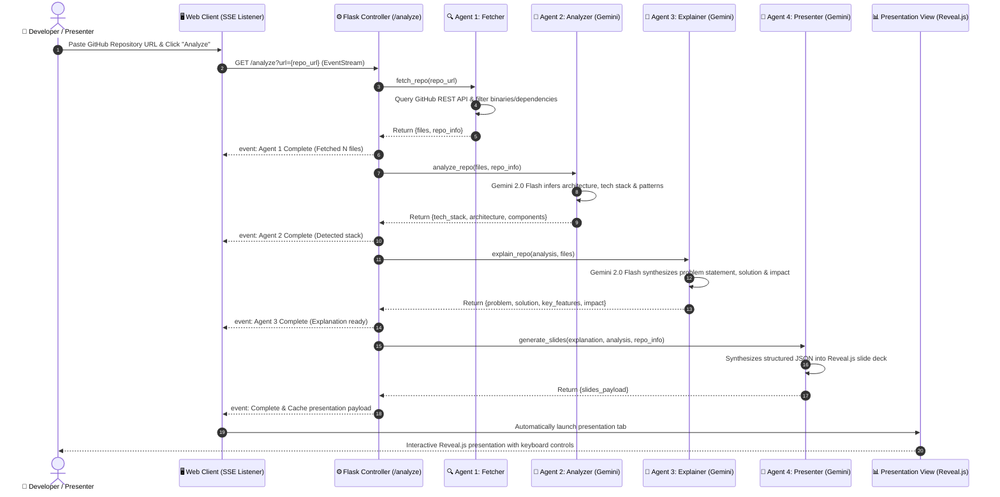

# 🤖 RepoNarrator AI — Multi-Agent GitHub Presentation Generator

[](https://www.python.org/downloads/)
[](https://ai.google.dev/)
[](agents/)
[-success?style=for-the-badge)](app.py)
[](https://revealjs.com/)
[](LICENSE)

> Transform any public GitHub repository into an executive-ready, interactive slide presentation in seconds using an autonomous 4-agent pipeline powered by Google Gemini 2.0 Flash and Server-Sent Events (SSE).

---

## 📑 Table of Contents
- [Multi-Agent Architecture & Sequence](#-multi-agent-architecture--sequence)
- [Agent Decomposition](#-agent-decomposition)
- [Key Technical Highlights](#-key-technical-highlights)
- [Interactive Demonstration Workflow](#-interactive-demonstration-workflow)
- [Repository Structure](#-repository-structure)
- [Local Development Setup](#-local-development-setup)
- [Author & Connect](#-author)
- [License](#-license)

---

## 📐 Multi-Agent Architecture & Sequence

The application choreographs four specialized AI agents connected via real-time **Server-Sent Events (SSE)**. State and artifacts pass downstream sequentially while streaming live progress directly to the browser UI:



---

## 🤖 Agent Decomposition

| Agent | Core Responsibility | Inputs | Outputs | AI Engine / Tool |
| :--- | :--- | :--- | :--- | :--- |
| **Agent 1: Fetcher** | Connects to GitHub REST API, parses repository trees, prioritizes source and configuration files, and filters binaries / build artifacts. | GitHub Repository URL | Manifest of key code files & repo metadata | GitHub API v3 / Python Requests |
| **Agent 2: Analyzer** | Inspects project directory hierarchies, package manifests, and code files to identify architecture patterns (MVC, Microservices, Event-Driven) and dependencies. | Filtered code files & metadata | Technical profile (languages, frameworks, DBs, design patterns) | Google Gemini 2.0 Flash |
| **Agent 3: Explainer** | Distills complex technical implementations into executive value propositions, problem definitions, architectural advantages, and real-world impact. | Technical profile & key files | Structured business & technical narrative | Google Gemini 2.0 Flash |
| **Agent 4: Presenter** | Transforms narrative points into structured presentation sections, speaker notes, and interactive Reveal.js slides. | Technical narrative & profile | Validated Reveal.js slide deck schema | Google Gemini 2.0 Flash + Reveal.js |

---

## ✨ Key Technical Highlights

1. **Autonomous Agentic Pipeline**:
   - Sequential multi-agent workflow where each agent operates with focused system instructions and specialized output schemas.
   - Graceful fallback routines for large codebases (context truncation, priority heuristics).

2. **Real-time Observability via Server-Sent Events (SSE)**:
   - Utilizes `text/event-stream` to establish a persistent unidirectional pipeline from the Python server to the frontend.
   - Eliminates polling latency while providing step-by-step transparency into agent thought processes and status.

3. **Reveal.js Presentation Engine**:
   - Generates interactive, accessible HTML5 slides with smooth 2D transition animations.
   - Full keyboard navigation support (<kbd>→</kbd>, <kbd>←</kbd>, <kbd>Space</kbd>, <kbd>Esc</kbd> for slide overview).
   - Embedded speaker notes and responsive layout for widescreen monitors and projectors.

4. **Zero-Hardcoding Configuration**:
   - Environment-driven API key management supporting both local `.env` and production PaaS environments.

---

## 🎯 Interactive Demonstration Workflow

1. **Launch**: Start the application and visit `http://127.0.0.1:5000`.
2. **Select Target Repository**: Click one of the quick chips or input any public GitHub URL (e.g. `https://github.com/ranjithbrs/secure-ai-journal-app`).
3. **Trigger Pipeline**: Click **Analyze →**.
4. **Live Agent Activity**: Observe the 4-agent status cards illuminate in real time:
   - 🔍 *Fetcher: Fetching repository tree and manifests...*
   - 🧠 *Analyzer: Identifying tech stack and architectural design...*
   - 💬 *Explainer: Distilling engineering impact and problem statement...*
   - 🎨 *Presenter: Compiling Reveal.js slide deck...*
5. **Interactive Deck**: A presentation window immediately launches, ready for live stakeholder presentations or technical interviews.

---

## 📁 Repository Structure

```text
reponarrator-ai/
├── app.py                      # Flask backend, SSE event streaming route & view controllers
├── Procfile                    # Production Gunicorn process manager definition
├── requirements.txt            # Python dependencies (Flask, google-genai, requests)
├── .env.example                # Template for Gemini API key configuration
├── README.md                   # Comprehensive project documentation
├── agents/
│   ├── fetcher.py              # Agent 1: GitHub API tree traversal & file filter
│   ├── analyzer.py             # Agent 2: Architecture & technology inference
│   ├── explainer.py            # Agent 3: Narrative & technical synthesis
│   └── presenter.py            # Agent 4: Reveal.js slide generation
├── static/
│   ├── css/                    # Dark glassmorphic design system
│   └── js/                     # SSE client listener & dynamic UI renderer
└── templates/
    ├── index.html              # Main multi-agent analysis dashboard
    └── presentation.html       # Full-screen Reveal.js presentation canvas
```

---

## 🚀 Local Development Setup

### Prerequisites
- Python 3.10 or higher installed.
- A **Google Gemini API Key** (obtain free from [Google AI Studio](https://aistudio.google.com/)).

### 1. Clone the Repository
```bash
git clone https://github.com/ranjithbrs/reponarrator-ai.git
cd reponarrator-ai
```

### 2. Install Dependencies
```bash
pip install -r requirements.txt
```

### 3. Configure Environment Variables
Create a `.env` file in the root folder:
```env
GEMINI_API_KEY=your_gemini_api_key_here
```

### 4. Run the Application
```bash
python app.py
```
Open your browser at `http://127.0.0.1:5000`.

---

## 👨‍💻 Author

**Ranjith B**  
🎓 *B.Tech Computer Science & Business Systems (CSBS)*  
🏛️ *Nehru Institute of Engineering and Technology, Coimbatore*  

- 💼 **LinkedIn**: [linkedin.com/in/ranjith-b-85907831a](https://linkedin.com/in/ranjith-b-85907831a)  
- 🐙 **GitHub**: [github.com/ranjithbrs](https://github.com/ranjithbrs)  
- 🌐 **Portfolio**: [ranjithbrs.github.io/portfolio](https://ranjithbrs.github.io/portfolio/)  
- 📧 **Email**: ranjithb2k06@gmail.com  

---

## 📄 License

This project is licensed under the [MIT License](LICENSE).
